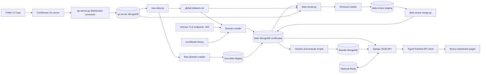
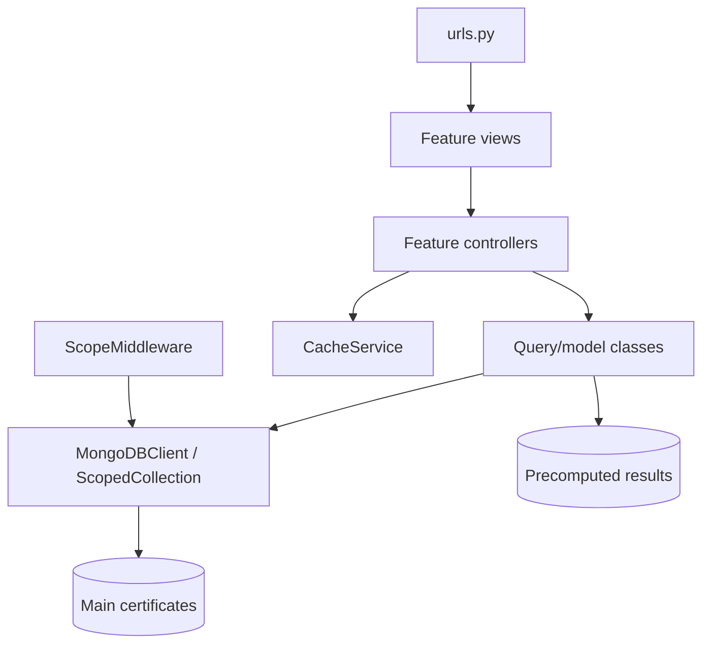
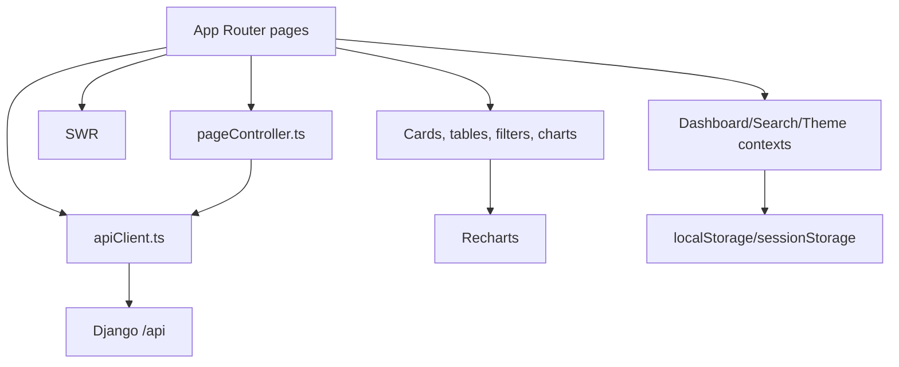

# Dependency Graph

## Evidence classification

Concrete imports, subprocess calls, URLs, database references, and file transfers are **Verified from repository**. The high-level grouping of these facts into one system/context diagram is **Inference — approval required** under I-025. No diagram may imply a production deployment or measured runtime behavior.

## End-to-end dependency graph

## Backend package dependencies

The layering is conventional in the feature packages, but query classes also contain serialization and business rules. `SharedModels` is a central dependency for certificate status, grading, filtering, serialization, and risk enrichment. Feature packages depend on `MongoDBClient` for live scoped reads and direct result-database access for materialized analytics.

## Frontend dependencies

## External dependencies and boundaries

- Public Internet: domain TLS services and Google/Chrome-configured CT logs.
- Local services: MongoDB at `localhost:27017`, optional Redis at `localhost:6379`, Django at port 8000, Next.js at port 3000, and the CertStream-compatible server at port 8080.
- Native executables: `zcertificate` and `certstream-server-go`.
- Filesystem contracts: input/output CSVs, PID file, CT checkpoint JSON, configuration JSON/YAML, and ignored logs.

## Dependency risks

- Several scripts hard-code local URLs, database defaults, or binary names instead of using the root configuration.
- The current Windows binaries have `.exe` suffixes, while scripts frequently expect extensionless paths.
- `go-server.py` uses `os.setsid`, a POSIX process primitive, despite the Windows repository environment.
- The shared-key list/detail pages hard-code `http://localhost:8000` instead of the frontend environment variable.
- Optional Redis failure is handled, but the application then sends all queries to MongoDB.
- No container/lockfile-based Python runtime definition covers every repository script.
