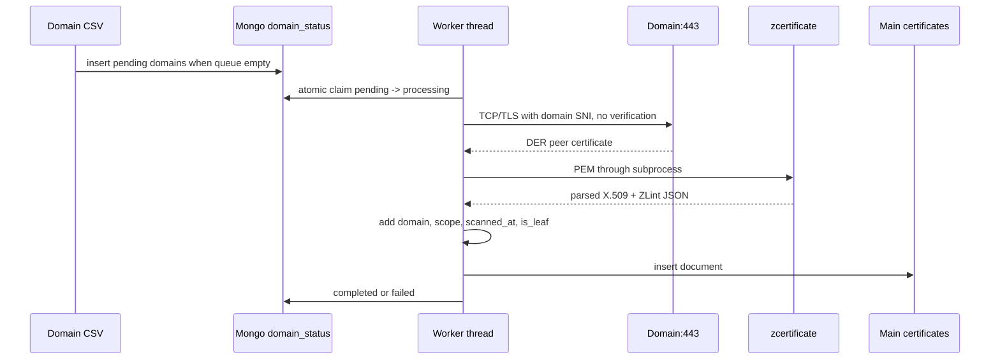
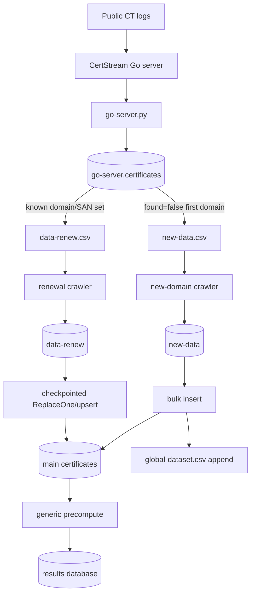
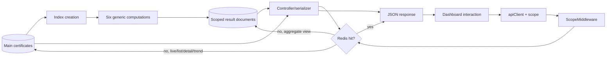

# Processing Pipeline

## Evidence classification

Every shown process/data edge maps to a concrete function, subprocess call, query, or file operation and is **Verified from repository**. System-wide reliability, freshness, exactly-once behavior, and failure consequences are not established by these diagrams and remain inference where discussed.

## Initial acquisition pipeline

## CT freshness pipeline

## Analytics/request pipeline

## Pipeline inputs and outputs

| Stage | Input | Transformation | Output |
|---|---|---|---|
| Dataset preparation | Tranco/Rapid7/supplied lists/APNIC data | filter, normalize, merge, deduplicate, CIDR summarize | domain/CIDR CSVs |
| Domain crawl | domain CSV | TLS retrieve, parse, ZLint, enrich | canonical certificate documents |
| CT ingestion | CT log stream | normalize SAN sets, batch/deduplicate | CT staging documents |
| Renewal selection | known domain CSV + CT staging | base/www variations, multikey match | renewal CSV |
| Renewal crawl | renewal CSV | same certificate acquisition | renewal staging documents |
| Renewal merge | staging documents | checkpointed replace/upsert by domain | refreshed main documents |
| New discovery | unprocessed CT documents | select/clean first domain, crawl | new staged/main documents and CSV append |
| Precompute | main certificates | scoped aggregations/scoring/bucketing | six results collections |
| API | request filters/scope | cache, live/materialized queries, serialization | JSON/CSV |
| UI | API responses | state, filtering, tables, visualizations | interactive dashboard |

## Failure handling

- Crawler failures are persisted in queue status/logs; stale processing work can be reset.
- CT server indices are persisted in `ct_index.json`.
- WebSocket batches and metadata flush on graceful shutdown.
- Renewal merge checkpoints only advance after a successful batch.
- Optional Redis failure falls back to MongoDB.
- Orchestrator steps log failures and generally abort the sequence.

There is no system-wide transaction, exactly-once guarantee, automated rollback, or committed disaster-recovery procedure.
